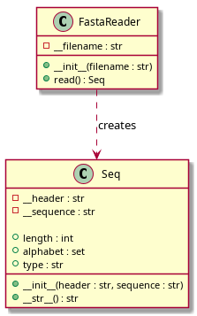

FASTA Sequence Reader
=====================

FASTA Sequence Reader
=====================

Описание проекта
----------------

Данный проект предназначен для чтения и анализа биологических
последовательностей, записанных в формате FASTA.

Проект состоит из двух основных классов:

* ``Seq`` — представляет отдельную биологическую последовательность;
* ``FastaReader`` — отвечает за чтение FASTA-файлов и получение
  отдельных объектов ``Seq``.

Класс ``Seq`` хранит заголовок FASTA-записи и последовательность.
Он позволяет получить длину последовательности, её уникальный алфавит
и определить тип последовательности: нуклеотидная или белковая.

Класс ``FastaReader`` читает FASTA-файл последовательно и возвращает
отдельные объекты ``Seq``. Использование генератора позволяет
обрабатывать большие файлы без необходимости загружать весь файл
в память одновременно.

Возможности программы
---------------------

Программа позволяет:

* читать последовательности из FASTA-файлов;
* получать заголовок каждой FASTA-записи;
* получать саму последовательность;
* определять длину последовательности;
* определять уникальный алфавит последовательности;
* определять тип последовательности;
* обрабатывать несколько последовательностей из одного файла;
* работать с большими FASTA-файлами с использованием генератора.

UML-диаграмма
-------------

Диаграмма показывает структуру классов проекта и связь между
классами ``FastaReader`` и ``Seq``.

Класс Seq
---------

.. autoclass:: seq.Seq
   :members:

Класс FastaReader
-----------------

.. autoclass:: fasta_reader.FastaReader
   :members:

Запуск программы
----------------

Для запуска демонстрационной программы необходимо перейти
в каталог проекта ``13-2`` и выполнить:

.. code-block:: console

   python3 main.py

Демонстрационная программа использует FASTA-файл ``example.fasta``,
содержащий примеры биологических последовательностей.

Пример работы
-------------

После запуска программа читает FASTA-файл и для каждой
последовательности выводит её основные характеристики:

* заголовок;
* последовательность;
* длину;
* уникальный алфавит;
* тип последовательности.

Пример результата:

.. code-block:: text

   >sp|P01308|INS_HUMAN Insulin
   MALWMRLLPLLALLALWGPDPAAA...

   Длина: 110
   Алфавит: {'A', 'C', 'D', 'E', 'F', ...}
   Тип: protein

Структура проекта
-----------------

Основные файлы проекта:

.. code-block:: text

   13-2/
   ├── seq.py
   ├── fasta_reader.py
   ├── main.py
   └── example.fasta

``seq.py`` содержит класс ``Seq``.

``fasta_reader.py`` содержит класс ``FastaReader``.

``main.py`` является демонстрационной программой.

``example.fasta`` содержит тестовые FASTA-последовательности.

Документация
------------

Документация проекта создана с использованием Sphinx.
HTML-версия документации собирается командой:

.. code-block:: console

   cd ~/13/docs
   make html

После сборки HTML-файлы находятся в каталоге:

.. code-block:: text

   docs/build/html/

Обработка ошибок
----------------

Программа проверяет корректность FASTA-файла.

В случае обнаружения ошибки может быть вызвано исключение
``ValueError`` с описанием проблемы.

Авторы
------

Eva Chernobaeva 3.2.33 <3

Версия проекта: 1.0
